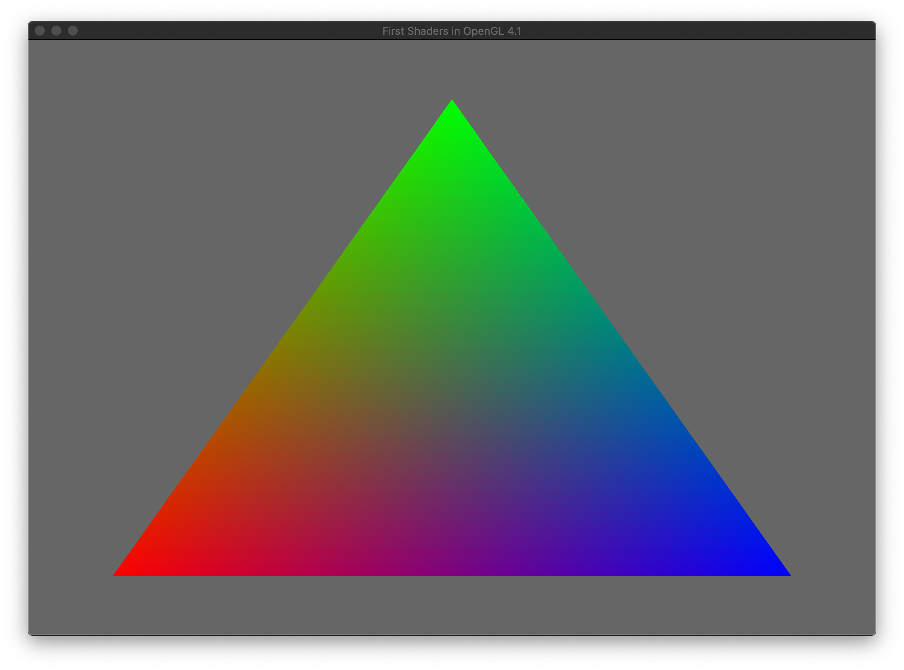

# Minimal OpenGL Demos



These demos will load a simple shader and draw a triangle using Modern OpenGL. Each demo will use different methods to generate the OpenGL Context and load the extensions. 

All extension loading libraries are assumed to be installed via vcpkg or in the system cmake search paths. At present The following libraries are going to be used for OpenGL Context creation

  - [Qt5](https://www.qt.io/)
  - [SDL2](https://www.libsdl.org/)
  - [GLFW](https://www.glfw.org/)
  - [FreeGLUT](http://freeglut.sourceforge.net/)
  - [SFML](https://www.sfml-dev.org/)
  - [Win32](https://docs.microsoft.com/en-us/windows/win32/opengl/opengl) (Windows Only) 
  - [Mac Native](https://developer.apple.com/documentation/appkit/nsapplication) (NSApplication Mac Only)
Extension loading will have examples from the following

  - [GLEW](http://glew.sourceforge.net/)
  - [GL3W](https://github.com/skaslev/gl3w)
  - glLoaderGen
  - Galogen
  - glad
  - glatter
  - glbinding
  - libepoxy

## OpenGL Code

The basic OpenGL code is split into two functions in the file GLFunctions.h, the first function ```GLuint createTriangle(float _size)``` creates a simple triangle with extents set by the ```_size``` parameter. This allows use to ensure that the triangle is visible within the canonical view volume (this is a unit cube with the origin at 0,0,0 and the extends in x,y,z ranging from -1 -> 1).

The function uses an [OpenGL Vertex Array Object](https://www.khronos.org/opengl/wiki/Vertex_Specification) to store two Buffers, One for Vertex positions (x,y,z) and One for Colour values (r,g,b). Each buffer is a new OpenGL Vertex Buffer Object and these will be bound to the first two inputs of the Vertex shader as vec3 types.

```c++
GLuint createTriangle(float _size)
{
  GLuint vaoID;
  // allocate a VertexArray
  glGenVertexArrays(1, &vaoID);
  // now bind a vertex array object for our verts
  glBindVertexArray(vaoID);
    // a simple triangle
  std::array<float,9> vert;	// vertex array
  vert[0] =-_size; vert[1] =  -_size; vert[2] =0.0f;
  vert[3] = 0; vert[4] =   _size; vert[5] =0.0f;
  vert[6] = _size; vert[7] =  -_size; vert[8]= 0.0f;
  // now we are going to bind this to our vbo
  GLuint vboID;
  glGenBuffers(1, &vboID);
  // now bind this to the VBO buffer
  glBindBuffer(GL_ARRAY_BUFFER, vboID);
  // allocate the buffer data
  glBufferData(GL_ARRAY_BUFFER, vert.size()*sizeof(float), &vert[0], GL_STATIC_DRAW);
  // now fix this to the attribute buffer 0
  glVertexAttribPointer(0, 3, GL_FLOAT, GL_FALSE, 0, 0);
  // enable and bind this attribute (will be inPosition in the shader)
  glEnableVertexAttribArray(0);

  std::array<float,9> colour={1.0f,0.0f,0.0f,
                              0.0f,1.0f,0.0f,
                              0.0f,0.0f,1.0f};

  GLuint colourvboID;
  glGenBuffers(1, &colourvboID);
  // now bind this to the VBO buffer
  glBindBuffer(GL_ARRAY_BUFFER, colourvboID);
  // allocate the buffer datra
  glBufferData(GL_ARRAY_BUFFER, colour.size()*sizeof(float), &colour[0], GL_STATIC_DRAW);
  // now fix this to the attribute buffer 1
  glVertexAttribPointer(1, 3, GL_FLOAT, GL_FALSE, 0, 0);
  // enable and bind this attribute (will be inColour in the shader)
  glEnableVertexAttribArray(1);
  // this basically switches off the current Vertex array object
  glBindVertexArray(0);
  return vaoID;
}
```

Not this code could allocate two buffers when calling the glGenBuffers but I chose not to do this for simplicity. It is the client program's job to store the returned vaoID for use when drawing and also to delete the buffer once finished with.

The second function ```GLuint loadShaderFromStrings( const std::string &_vertex, const std::string &_fragment)``` takes two strings one for a [vertex shader](https://www.khronos.org/opengl/wiki/Vertex_Shader) and one for a [fragment shader](https://www.khronos.org/opengl/wiki/Fragment_Shader#:~:text=A%20Fragment%20Shader%20is%20the,a%20%22fragment%22%20is%20generated.).  These strings are expected to be the full shader source strings. In these example I use [C++ 11 raw string literals](https://en.cppreference.com/w/cpp/language/string_literal) for ease.

The function will generate an [OpenGL Shader program](https://www.khronos.org/opengl/wiki/Shader_Compilation) then attach Vertex and Fragment shader programs to it. Compile and them link them. There is also an internal function (in GLFunctions.cpp) to check the compilation and link status of the shaders and report any errors.

```c++
GLuint loadShaderFromStrings( const std::string &_vertex, const std::string &_fragment)
{
 // here we create a program
 GLuint shaderID=glCreateProgram();
 
  // create a Vertex shader object
  GLuint vertexID=glCreateShader(GL_VERTEX_SHADER);
  // attatch the shader source we need to convert to GL format
  const char* source=_vertex.c_str();
  glShaderSource(vertexID,1,&source,NULL);
  // now compile the shader
  glCompileShader(vertexID);
  std::cerr<<"compiling vertex shader\n";
  printInfoLog(vertexID);

// now create a fragment shader
  GLuint fragmentID=glCreateShader(GL_FRAGMENT_SHADER);
  // attatch the shader source
  source=_fragment.c_str();
  glShaderSource(fragmentID,1,&source,NULL);
  // compile the shader
  std::cerr<<"compiling frag shader shader\n";
  glCompileShader(fragmentID);
  printInfoLog(fragmentID);
  // now attach to the program object
  glAttachShader(shaderID,vertexID);
  glAttachShader(shaderID,fragmentID);
  
  // link the program
  glLinkProgram(shaderID);
  printInfoLog(shaderID,GL_LINK_STATUS);
  // and enable it for use
  glUseProgram(shaderID);
  // now tidy up the shaders as we don't need them
  glDeleteShader(vertexID);
  glDeleteShader(fragmentID);
  return shaderID;
}
```

The function will return the shaderID of the program and by default it will enable this program as the active shader in the current [OpenGL state](https://www.khronos.org/opengl/wiki/Portal:OpenGL_Concepts). It is the client programs job to delete the Shader Program one it is finished with it.

## Demos

[**QtTriangleGLEW**](QtTriangleGLEW) :- use Qt to create and OpenGL context and Glew to load extensions. This will work under mac, windows and linux as long as Qt and GLEW are installed.

[**WindowsTriangleGLEW**](WindowsTriangleGLEW) :- use Win32 to create a window and glew to load extensions. This is based on [this](https://gist.github.com/nickrolfe/1127313ed1dbf80254b614a721b3ee9c) gist for windows creation and could do with updating.

[**SDL2TriangleGLEW**](SDL2TriangleGLEW) :- use [SDL2](https://www.libsdl.org/) to create and OpenGL context and GLEW to load extensions. This will work under mac, windows and linux as long as SDL2 and GLEW are installed.

[**GLFWTriangleGLEW**](GLFWTriangleGLEW) :- use [GLFW3](https://www.glfw.org/) to create and OpenGL context and GLEW to load extensions. This will work under mac, windows and linux as long as SDL2 and GLEW are installed.


## TODO 

- add the libs from here https://www.khronos.org/opengl/wiki/OpenGL_Loading_Library#glLoadGen_.28OpenGL_Loader_Generator.29
- investigate EGL
- Python Demos
- WebGL simple demo
- OpenGL ES Demo?

